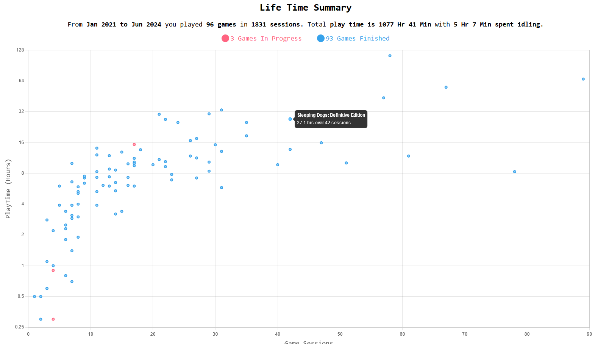
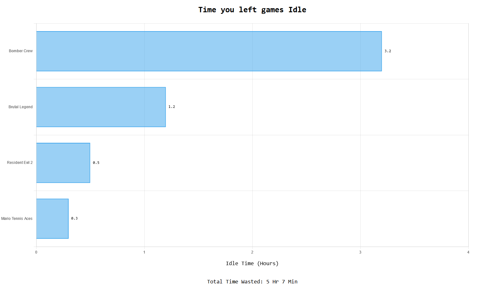
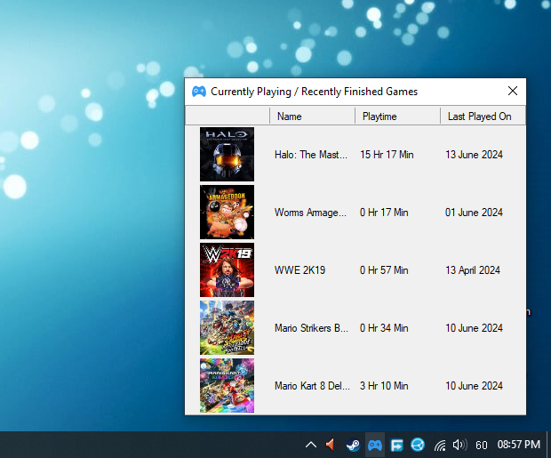
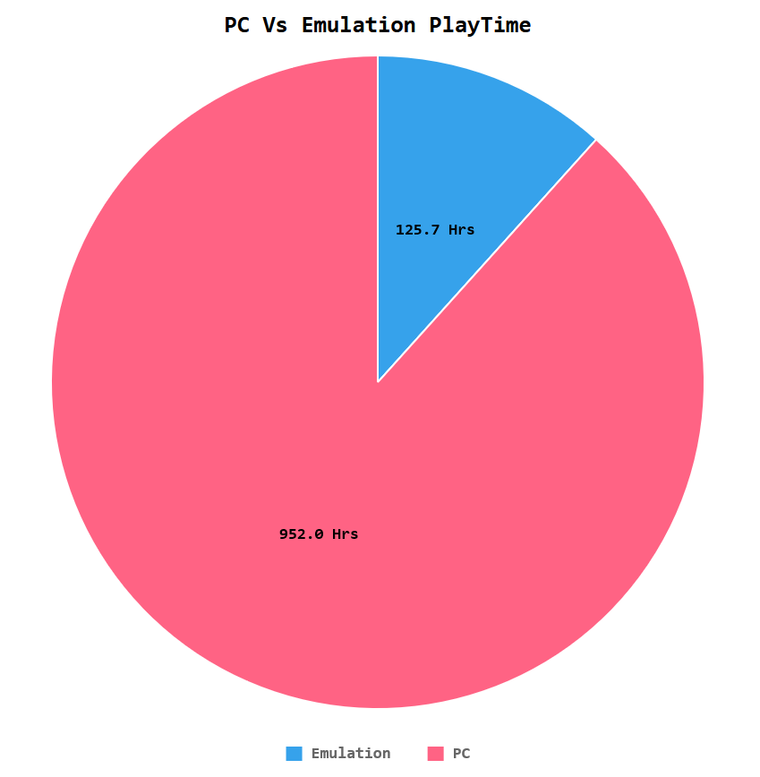

### 外伝 (Gaiden)

Japanese

noun (common)

A Tale; Side Story;

A simple windows system tray application written in powershell to track your gaming time and review how you have spent your hours at leisure. 

## Features
- #### Time Tracking and Emulator Support
    - Tracks runtime for any PC or emulated game.
    - Automatically track all new emulated games by just registering the emulator only once.
    - Retroarch supported. Track different retroarch cores as distinct emulated platforms.
    - Supports tracking for multiple emulators for single console. e.g. Ryjinx and Yuzu for Switch.
    - Idle time tracking based on absence of user input from KB/M or Gamepads. Removes idle time from play time for accurate playtime measurements.
    - Tracks number of sessions per game.
    - Works best with command line based emulation frontends like EmulationStation, LaunchBox and other standalone emulators. 
    - Pause or resume tracking anytime without exiting the app.
    - HWiNFO64 Sensor. Track game time recording status in RTSS / HWiNFO overlays.
- #### UI and Statistics
    - Fast HTML based UI rendered using your default browser. Take screenshots/print pdfs to share with friends from your browser.
    - Quick view, 5 most recent in progress / finished games with total playtime and last played dates.
    - Detailed Games list UI with search and sorting. Editable game icons. Relative play time comparison bar for each game.
    - Quick google image search button for finding game icons / box art.
    - Games can be marked finished / in progress for backlog records.
    - Lifetime gaming summary graph showing playtime vs session count of each game. Total play time, idle time, in progress and finished games.
    - Daily, Monthly and Yearly play time statstics with highlighted weekends.
    - Shows most played games and number of games played per platform.
    - PC vs Emulation time.
- #### Quality of Life Features
    - Extremely lightweight. ~7 MB install size. Single process with very low resource usage.
    - Completely offline and portable. No internet required. All data stored locally.
    - Automated data backup on every gaming session. Keeps 5 latest backups.
    - Detailed how to use manual. Just click Help from menu.
    - Detailed logging to identify bugs and errors.

## Feature Screenshots
   

  

 

   

## Feature Demos
- [Tracking PC Games](https://youtu.be/QHVJvWrDWC4)
- [Tracking Emulated Games](https://youtu.be/ltRJVeOxr1s)
- [Tracking Retroarch Games](https://youtu.be/RvE6_fYAiRM)
- [Gaming Stastics & Other Features](https://youtu.be/gIqdKGoQDGM)
- [HWiNFO Sensor](https://youtu.be/pFe80EzFog8)

## Vs Steam, Playnite etc.
For purely tracking play time, Gaming Gaiden has much more features than the above launchers. Ease of use with Emulators is much higher. You don't need to add each emulated game individually. It has HWiNFO integration and consumes very less resources.

Biggest feature though are the stastics that it generates from your data. The launchers do time tracking at best as a side feature. Gaming Gaiden is designed to give you insights to your hobby. It's stastics feature will answer questions like 
- *Are you really gaming for same hours as you used to? Is your beloved hobby still alive?*
- *Are you playing too much, is gaming affecting your life?*
- *Did you play enough games / enough hours since you bought that new PC to justify it's cost?*
- *You setup such complex emulation setup, how many emulated games you actually played?*

It adds value to your gaming hobby by gathering data quietly in background and then making it super easy for you to draw conclusions and bring changes.

## How to install / upgrade
1. Download ***GamingGaiden.zip*** from the [latest release](https://github.com/kulvind3r/GamingGaiden/releases/latest).
2. Extract ***GamingGaiden*** folder and Run `Install.bat`.
3. Use the shortcuts on desktop / start menu for launching the application. If you answered 'y | yes' for setting up autostart, application will also start at boot. 

## "Unknown Publisher"
Windows smart screen may give a warning that application executable is from an ***Unknown Publisher***. This is due to application not being signed with a public CA approved certificate. 
These certifactes cost 100s of Dollars annually to purchase. Naturally I can't spend that much for something built for casual and personal user primarily. Use at your own discretion.

## Antivirus False Positives
Powershell Module [ps12exe](https://github.com/steve02081504/ps12exe) written by [Steve Green](https://github.com/steve02081504) is used to convert the primary script of Gaming Gaiden into native exe.

Program's such as ps12exe are often abused by bad actors to write malicious applications and very soon a lot of antivirus companies start flagging any exe created by such programs as a virus. This can happen to ps12exe as well and it is possible that any executable created using ps12exe also starts being flagged as a virus in future.

Every release of Gaming Gaiden is personally used by me and Virus Total Scan links will be attached in all releases after v2024.7.5. All earlier releases will remain without native exe and purely powershell driven.

Beyond this minimal assurance, you will have to judge for yourself whether you want to use Gaming Gaiden or not. Code of Gaming Gaiden and of ps12exe is open and available for scrutiny. 

## Protecting your Data
Make sure you regularly copy `GamingGaiden.db` and your `backups` folder to a safe location like Cloud or external storage. 
Otherwise you risk loosing your data, if your Windows installation gets corrupt or you reinstall / upgrade your Windows OS.

You can find the above files by clicking ***Settings => Open Install Directory*** option in app menu.

## Attributions
Made with love using 

- [PSSQLite](https://www.powershellgallery.com/packages/PSSQLite) by [Warren Frame](https://github.com/RamblingCookieMonster)
- [ps12exe](https://github.com/steve02081504/ps12exe) by [Steve Green](https://github.com/steve02081504)
- [DataTables](https://datatables.net/)
- [Jquery](https://jquery.com/)
- [ChartJs](https://www.chartjs.org/)
- Various Icons from [Icons8](https://icons8.com)
- Game Cartridge Icon from [FreePik on Flaticon](https://www.flaticon.com/free-icons/game-cartridge)
- Cute [Ninja Vector by Catalyststuff on Freepik](https://www.freepik.com/free-vector/cute-ninja-gaming-cartoon-vector-icon-illustration-people-technology-icon-concept-isolated-flat_42903434.htm)
- [Ninja Garden Font](https://www.fontspace.com/ninja-garden-font-f32923) by [Iconian Fonts](https://www.fontspace.com/iconian-fonts)

## Raising Bugs
Read the included manual and installation steps mentioned above carefully before raising issues. Check carefully if you didn't follow anything as instructed. You might be able to solve your issue without needing help.

As a solo dev, I will try my best to provide support/fixes for any genuine bugs in existing features based on time availability. No new feature requests please.
