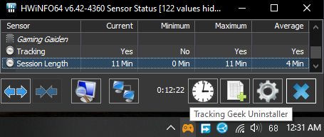

### 外伝 (Gaiden)

Japanese

noun (common)

A Tale; Side Story;

A simple application written in powershell to track your gaming time and review how you have spent your hours at leisure. 

## Features
- #### Time Tracking and Emulator Support
    - Tracks runtime for any PC or emulated game.
    - Automatically track all new emulated games by just registering the emulator only once.
    - Retroarch supported. Track different retroarch cores as distinct emulated platforms.
    - Works best with command line based emulation frontends like EmulationStation, LaunchBox and other standalone emulators. 
    - Stop or resume tracking anytime without exiting the app.
    - HWiNFO64 Sensor. Track game time recording status in RTSS / HWiNFO overlays.
- #### UI and Statistics
    - Detailed Games list UI with search and sorting. Editable game icons. Games can be marked finished for backlog records.
    - Shows most played games and number of games played per platform.
    - Daily, Monthly and Yearly play time statstics.
- #### Quality of Life Features
    - Extremely lightweight. 7 MB install size. Single process. Uses less than 50 MB Memory and less than 1% CPU.
    - Completely offline and portable. No internet required. All data stored locally.
    - Automated data backup on every gaming session. Keeps 5 latest backups.
    - Automated scheduled task setup on install to run at startup and start tracking.
    - Detailed how to use manual. Just click Help from menu.
    - Detailed logging to identify bugs and errors.

## Feature Screenshots
  

  

  

## Feature Demos
- [Tracking PC Games](https://youtu.be/QHVJvWrDWC4)
- [Tracking Emulated Games](https://youtu.be/ltRJVeOxr1s)
- [Tracking Retroarch Games](https://youtu.be/RvE6_fYAiRM)
- [Gaming Stastics & Other Features](https://youtu.be/gIqdKGoQDGM)
- [HWiNFO Sensor](https://youtu.be/pFe80EzFog8)

## Vs Steam, Playnite etc.
For purely tracking play time, Gaming Gaiden has much more features than the above launchers. Ease of use with Emulators is much higher. You don't need to add each emulated game individually. HWiNFO integration and lightweight background process that you can launch and forget are other important ones.

Biggest feature though are the stastics that it generates from your data. The launchers do time tracking at best as a side feature. Gaming Gaiden is designed to give you insights to your hobby. It's stastics feature will answer questions like 
- *Are you really gaming for same hours as you used to? Is your beloved hobby still alive?*
- *Are you playing too much, is gaming affecting your life?*
- *Did you play enough games / enough hours since you bought that new PC to justify it's cost?*
- *You setup such complex emulation setup, how many emulated games you actually played?*

This application should add value to your gaming hobby by gathering data quietly in background and then making it super easy for you to draw conclusions and bring changes.

## How to install
1. Download ***GamingGaiden.zip*** from the [latest release](https://github.com/kulvind3r/GamingGaiden/releases/latest).
2. Extract "GamingGaiden" folder and copy it to a location where you would like to run it from. ***Do Not Use "C:/Program Files" or any other protected location that needs admin rights.***
3. Right click `Install.bat` and click `Run as administrator`.
4. Optionally choose to setup a scheduled task to autostart at user login.
5. Once installation is done, you will have a shortcut to run the application on desktop and start menu. Just double click the shortcut to start the application.
6. _**On Starting from Shortcut, a brief command line window flashes and then the application runs in the System Tray. It is Tray app. It has no GUI window. All Operations are done from right click menu of tray app. All Lists, Graphs, Stastics will be shown in your default internet browser.**_ Please watch the youtube tutorials shared above to learn how to use the application.
7. If you move the application to another directory, simply run `Install.bat` once again as administrator, to setup from the new location.

## DISCLAIMER
1. `Install.bat` needs to be run as administrator to create the scheduled task for starting automatically on system startup.
2. All shortcuts and scheduled tasks will include the parameter `-ExecutionPolicy bypass` so that powershell scripts can be run. Windows by default doesn't allow powershell scripts to be executed.

## Attributions

Made with love using 

- [PSSQLite](https://www.powershellgallery.com/packages/PSSQLite) by [Warren Frame](https://github.com/RamblingCookieMonster)
- [DataTables](https://datatables.net/)
- [Jquery](https://jquery.com/)
- [ChartJs](https://www.chartjs.org/)
- Various Icons from [Icons8](https://icons8.com)
- Game Cartridge Icon from [FreePik on Flaticon](https://www.flaticon.com/free-icons/game-cartridge)
- Cute [Ninja Vector by Catalyststuff on Freepik](https://www.freepik.com/free-vector/cute-ninja-gaming-cartoon-vector-icon-illustration-people-technology-icon-concept-isolated-flat_42903434.htm)
- [Ninja Garden Font](https://www.fontspace.com/ninja-garden-font-f32923) by [Iconian Fonts](https://www.fontspace.com/iconian-fonts)

## Raising Bugs

***Read the included manual first before raising issues. You might be able to solve it without needing help.***

As a single dev, i have tested the application to best of my ability before making it public. However a large number of users is the first rigrous QA process the application is going to get. Bugs that i missed are bound to be found so kindly be patient. Bug reports in current feature set are welcome. Please share.

I will try my best to fix bugs that are valid for the current set of features. If a bug report looks more like a new feature being requested instead of something broken in existing features. I may chose not to work on that. I believe the application is feature complete for what it is trying to do and i don't plan to add any additional features for most part.

I would much rather actually play games than keep on developing this.

## I have More Questions
Check [FAQ](./readme-files/FAQ.md)
