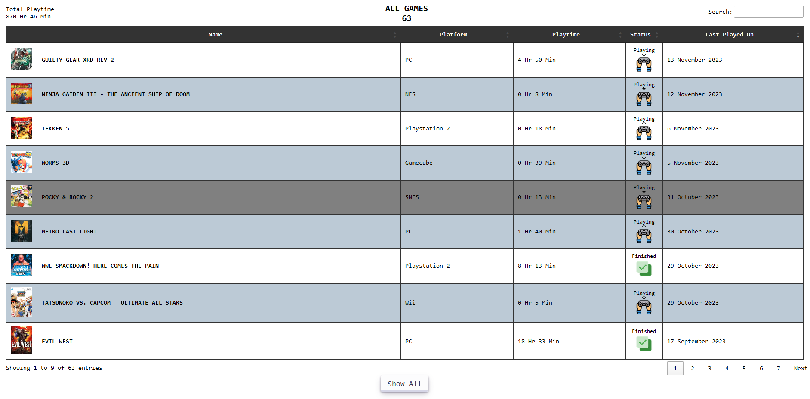
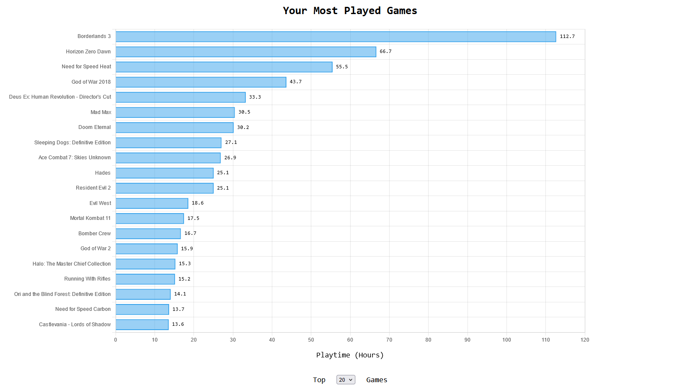
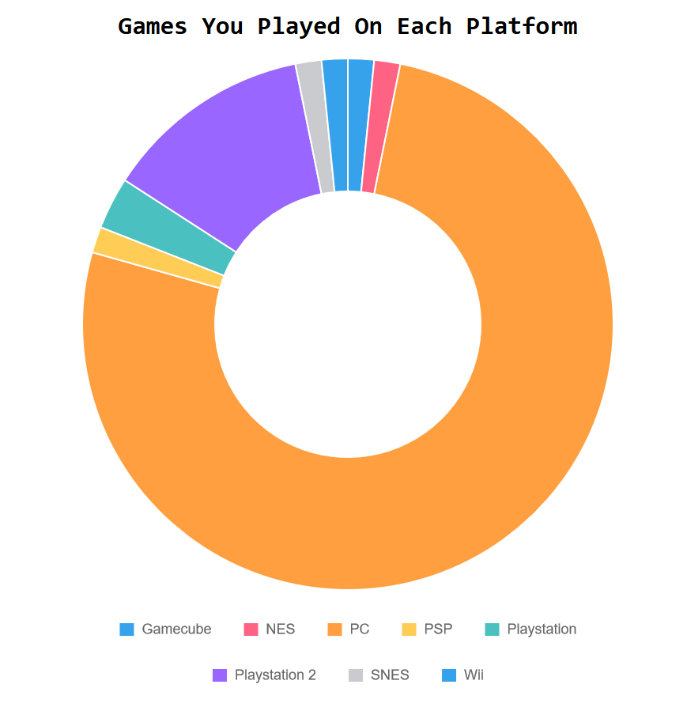
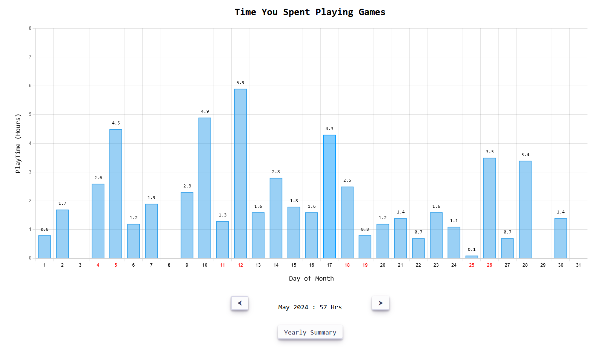
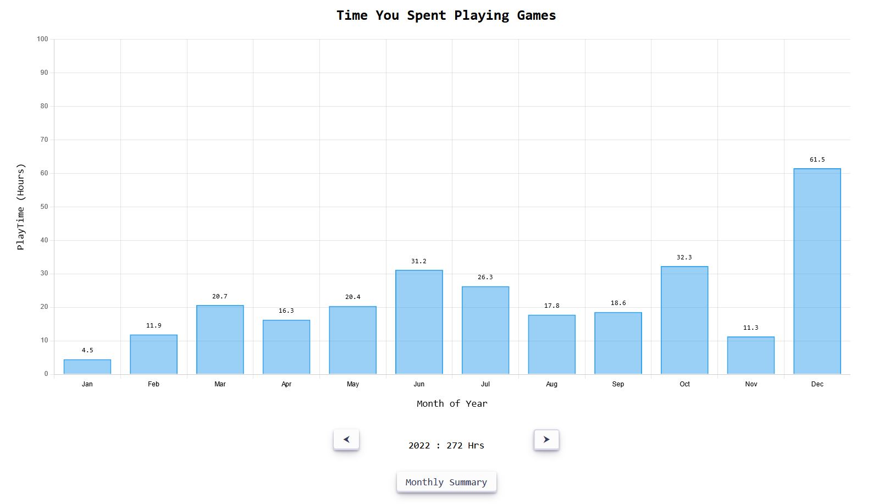

### 外伝 (Gaiden)

Japanese

noun (common)

A Tale; Side Story;

A simple application written in powershell to track your gaming time and review how you have spent your hours at leisure. 

## Features
- Tracks runtime for any PC or emulated game.
- Automatically track all new emulated games by just registering the emulator only once.
- Retroarch Supported. Track different retroarch cores as distinct emulated platforms.
- Works best with command line based emulation frontends like EmulationStation, LaunchBox and other standalone emulators. 
- Detailed Games list UI with search and sorting. Editable game icons. Games can be marked finished for backlog records.
- Extremely lightweight. 4 MB install size. Single process. Uses just 60 MB memory at runtime.
- Stop and resume tracking anytime without exiting the app.
- Daily, Monthly and Yearly play time statstics.
- Shows most played games and number of games played per platform.
- Completely offline. No internet required after first installation. All data stored locally.
- Portable, no MSI installer or setup. Just unzip and run install script.
- Protects Data. Database backup on every update. Keeps 5 latest backups. 
- Automated scheduled task setup on install to run at startup and start tracking.
- Detailed how to use manual. Just click Help from menu.
- Detailed logging to identify bugs and errors.

## Feature Screenshots
  
 

## Feature Demos
- [Tracking PC Games](https://youtu.be/QHVJvWrDWC4)
- [Tracking Emulated Games](https://youtu.be/ltRJVeOxr1s)
- [Tracking Retroarch Games](https://youtu.be/RvE6_fYAiRM)
- [Gaming Stastics & Other Features](https://youtu.be/gIqdKGoQDGM)

## Vs Steam, Playnite etc.
The launchers do time tracking at best as a side feature. Gaming Gaiden is designed to give you insights to your hobby. It's stastics feature will answer questions like 
- *Are you really gaming for same hours as you used to? Is your beloved hobby still alive?*
- *Are you playing too much, is gaming affecting your life?*
- *Did you play enough games / enough hours since you bought that new PC to justify it's cost?*
- *You setup such complex emulation setup, how many emulated games you actually played?*

This application should add value to your gaming hobby by gathering data quietly in background and then making it super easy for you to draw conclusions and bring changes.

## How to install
1. Download the latest release zip file from releases page.
2. Extract "GamingGaiden" folder and copy it to a location where you would like to run it from. **Do Not Use "C:/Program Files" or any other protected location that needs admin rights.**
3. Right click "Install.ps1" and click "Run with powershell". You must be connected to Internet at this point to download dependencies.
4. Optionally choose to setup a scheduled task to autostart at user login.
5. Once installation is done, you will have a shortcut to run the application on desktop and start menu.
6. If you move the application to another directory, simply run "Install.ps1" once again, to setup from the new location.

## DISCLAIMER
Windows by default doesn't allow Powershell scripts downloaded from internet to be run. Windows powershell execution policy must be changed to RemoteSigned to allow the application scripts to be run.

Install script does this by automatically elevating itself to Admin priveleges, you will see a UAC dialog if UAC is enabled to authorize this. You can freely review the code to see the steps Install script takes while running as admin and choose to allow it to run or not.

This is just a one time privelege escalation for installing dependencies and changing execution policy. Primary application does not need admin rights to run.

## Attributions

Made with love using 

- [PSSQLite](https://www.powershellgallery.com/packages/PSSQLite) by [Warren Frame](https://github.com/RamblingCookieMonster)
- [DataTables](https://datatables.net/)
- [Jquery](https://jquery.com/)
- [ChartJs](https://www.chartjs.org/)
- Various Icons from [Icons8](https://icons8.com)
- Game Cartridge Icon from [FreePik on Flaticon](https://www.flaticon.com/free-icons/game-cartridge)
- Cute [Ninja Vector by Catalyststuff on Freepik](https://www.freepik.com/free-vector/cute-ninja-gaming-cartoon-vector-icon-illustration-people-technology-icon-concept-isolated-flat_42903434.htm)

## Raising Bugs

***Read the included manual first before raising issues. You might be able to solve it without needing help.***

As a single dev, i have tested the application to best of my ability before making it public. However a large number of users is the first rigrous QA process the application is going to get. Bugs that i missed are bound to be found so kindly be patient. Bug reports in current feature set are welcome. Please share.

I will try my best to fix bugs that are valid for the current set of features. If a bug report looks more like a new feature being requested instead of something broken in existing features. I may chose not to work on that. I believe the application is feature complete for what it is trying to do and i don't plan to add any additional features for most part.

I would much rather actually play games than keep on developing this.

## I have More Questions
Check [FAQ](./readme-files/FAQ.md)
