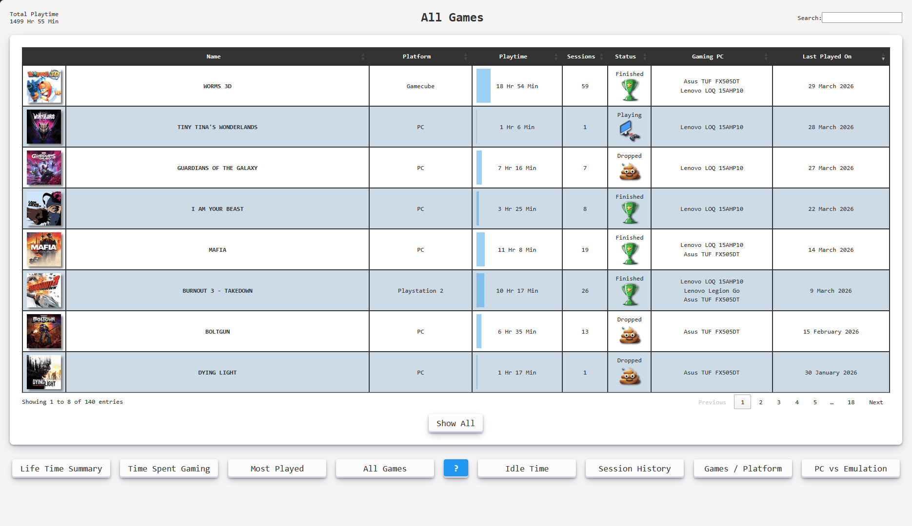

[kulvind3r.github.io/GamingGaiden](https://kulvind3r.github.io/GamingGaiden/)

### 外伝 (Gaiden)

Japanese | noun (common) | A Tale; Side Story;

Tiny tray application for windows to track gaming time. Helps you record your gaming story over the years.

## Features
- #### Time Tracking and Emulator Support
    - Tracks play time & session history for PC or emulated games.
    - Auto tracks new roms after registering any emulator just once.
    - Supports Retroarch cores.
    - Detects and removes idle time from gaming sessions.
    - Out of box HWiNFO64 integration with session time and tracking status metrics.
    - Install on multiple gaming pcs and share database to tracks games played, hours played for each pc separately.
- #### UI and Statistics
    - Fast browser based UI with search and sorting. Quick view popup for recent games.
    - Multiple in depth statistics on gaming. Lifetime summary, Session count and lenght, Daily/Monthly/Yearly time analysis, most played games, games per emulator etc.
    - Value for money analysis for gaming pc, gaming cost per hour.
    - Integrated google image search for game icons / box art.
    - Mark games as Playing / Finished / On Hold / Dropped to track backlog completion.
- #### Quality of Life Features
    - Small size (~7 MB). High performance (Sub 5 sec game detection). Light on cpu & ram.
    - Completely offline and portable, all data stored in local database.
    - Automated data backup after each gaming session.

> [!WARNING]  
> Gaming Gaiden is only available for download on this Github repo. Any copy available elsewhere could be malicious.

## How to install / upgrade / use
1. Download ***GamingGaiden.zip*** from the [latest release](https://github.com/kulvind3r/GamingGaiden/releases/latest).
2. Extract ***GamingGaiden*** folder and Run `Install.bat`. Choose Yes/No for autostart at Boot.
3. Use the shortcut on desktop / start menu for launching the application.
4. Regularly backup your `GamingGaiden.db` and `backups` folder to avoid data loss. Click ***Settings => Open Install Directory*** option in app menu to find them.

## How to uninstall
Run `Uninstall Gaming Gaiden` from the `Gaming Gaiden` start menu folder. `GamingGaiden.db` and `backups` are not removed for preserving data.

## Unknown Publisher
Windows SmartScreen may warn that the application is from an ***Unknown Publisher*** because it lacks signature from a public CA. 
Signing cost for apps is hundreds of dollars per year. Can't afford them.

## Attributions
Made with love using 

- [PSSQLite](https://www.powershellgallery.com/packages/PSSQLite) by [Warren Frame](https://github.com/RamblingCookieMonster)
- [DOMPurify](https://github.com/cure53/DOMPurify) by [Cure53](https://github.com/cure53)
- [DataTables](https://datatables.net/)
- [Jquery](https://jquery.com/)
- [ChartJs](https://www.chartjs.org/)
- Various Icons from [Icons8](https://icons8.com)
- Game Cartridge Icon from [FreePik on Flaticon](https://www.flaticon.com/free-icons/game-cartridge)
- Cute [Ninja Vector by Catalyststuff on Freepik](https://www.freepik.com/free-vector/cute-ninja-gaming-cartoon-vector-icon-illustration-people-technology-icon-concept-isolated-flat_42903434.htm)
- [Ninja Garden Font](https://www.fontspace.com/ninja-garden-font-f32923) by [Iconian Fonts](https://www.fontspace.com/iconian-fonts)

